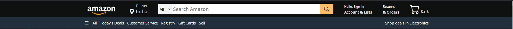
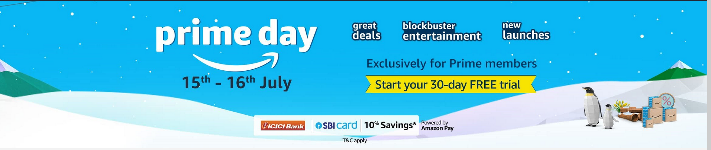
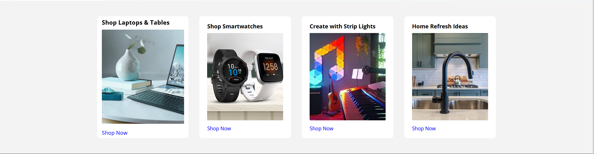

# Amazon UI Project

## Table of Contents
1. [Introduction](#introduction)
2. [Screenshots and Explanation](#screenshots-and-explanation)
    - [Header](#header)
    - [Main Banner](#main-banner)
    - [Category Section](#category-section)
    - [Back to Top Section](#back-to-top-section)
    - [Footer](#footer)
3. [CSS Properties](#css-properties)

## Introduction
This project is a UI clone of the Amazon website created using HTML and CSS. The design includes various components such as a header, main banner, category section, back to top section, and footer. Below are the screenshots and explanations of each part of the HTML along with the CSS properties used.

## Screenshots and Explanation

### Header

- **HTML Tags**: `<header>`, `
`, ``, `
`, `<a>`, `<i>`, `<select>`, `<input>`, `<ul>`, `<li>`
- **Description**: The header contains the Amazon logo, delivery location, search bar, account links, orders link, and cart.
- **CSS Properties**:
    - Background color, height, flexbox for alignment, padding, font size, text alignment, color.

### Main Banner

- **HTML Tags**: `<section>`
- **Description**: The main banner section displays a large background image.
- **CSS Properties**:
    - Background image, background position, background repeat, background size, height.

### Category Section

- **HTML Tags**: `<section>`, `
`, `<h2>`, ``, `
`, `<a>`
- **Description**: This section includes multiple cards with images, text, and links to shop for various categories.
- **CSS Properties**:
    - Background color, padding, grid layout, border-radius, transition for hover effects, text properties, image properties.

### Back to Top Section

- **HTML Tags**: `<section>`, `
`, `<a>`
- **Description**: A simple section with a link to scroll back to the top of the page.
- **CSS Properties**:
    - Background color, text alignment, font size, padding, color.

### Footer

- **HTML Tags**: `<footer>`, `
`, `<h3>`, `<ul>`, `<li>`, `<a>`
- **Description**: The footer contains multiple lists of links including 'Get to Know Us', 'Connect with Us', 'Make Money with Us', and 'Let Us Help You'.
- **CSS Properties**:
    - Background color, padding, flexbox for alignment, font size, color, text decoration.

## CSS Properties
- **General Properties**:
    - `padding`, `margin`, `box-sizing`, `font-family`
- **Typography**:
    - `font-size`, `font-weight`, `color`, `text-align`, `text-decoration`
- **Layout**:
    - `display`, `flex`, `justify-content`, `align-items`, `grid-template-columns`
- **Background and Borders**:
    - `background-color`, `background-image`, `background-position`, `background-repeat`, `background-size`, `border-radius`
- **Dimensions**:
    - `height`, `width`, `max-width`
- **Transitions**:
    - `transition`, `transform`

These components together create a simple yet effective UI similar to Amazon's design. The use of flexbox and grid layout ensures a responsive and organized structure, while various CSS properties enhance the visual appeal and user experience.
